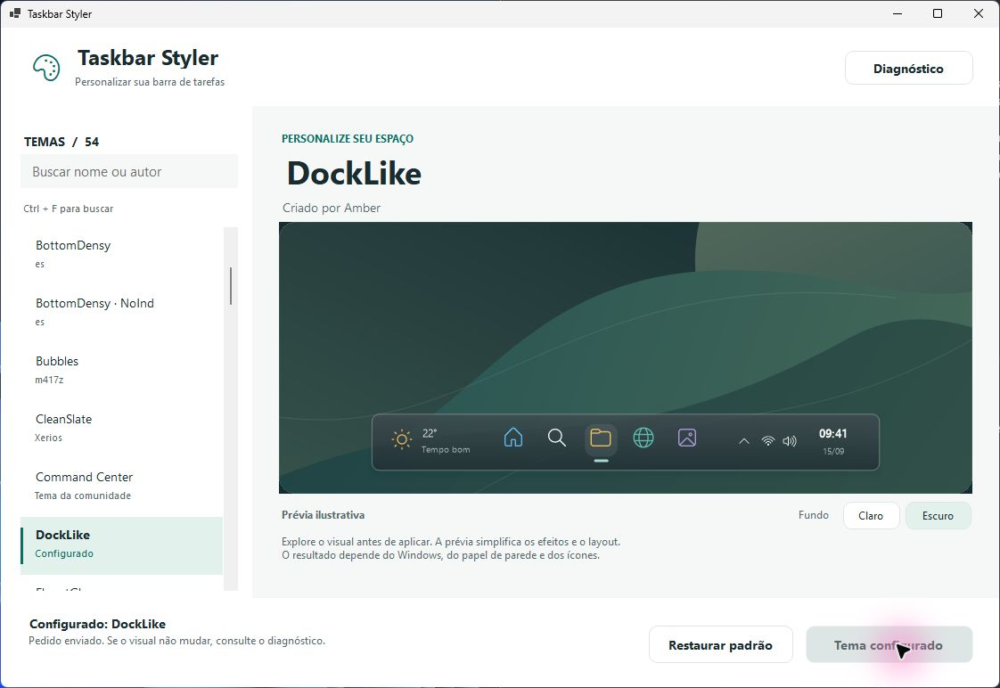

# taskbar-styler

Customiza a taskbar do Windows 11 sem depender do Windhawk.

Obra derivada do mod [windows-11-taskbar-styler](https://github.com/ramensoftware/windhawk-mods)
(m417z, GPL-3.0), reescrita como aplicativo independente.

## Como funciona

O Windows carrega uma DLL COM dentro do `explorer.exe` por meio da API de
diagnóstico do XAML (`InitializeXamlDiagnosticsEx`) — o mesmo mecanismo do Live
Visual Tree do Visual Studio. Essa DLL recebe a árvore visual da taskbar e
aplica os estilos do tema escolhido.

**Não há injeção de DLL nem patch de código.** Nada de `CreateRemoteThread`,
`WriteProcessMemory` ou hooks inline: apenas APIs sancionadas do Windows. E não
há nenhum acesso à rede em runtime.

## Estado

Em desenvolvimento. O que já existe:

- [x] `styler_core` — parsing de seletores, regras de estilo e temas
- [x] 55 temas em JSON, com conversão provada sem perda byte a byte
- [x] TAP que carrega no explorer e exporta a árvore visual
- [x] Aplicar e desfazer estilos (Plano 3)
- [x] Blur de composição real e variáveis de estilo por elemento (Plano 3b)
- [x] O aplicativo de bandeja (Plano 4)
- [x] Catálogo visual com busca e prévia antes de aplicar (Plano 5)

O Plano 4 está concluído, com bandeja WinForms, recuperação do Explorer e
validação do ciclo de vida do TAP. Testes de longa duração continuam pendentes.
Estado e pendências: [docs/STATUS.md](docs/STATUS.md).



## Compilando

Requer Visual Studio 2026 com o toolchain C++ e o Windows SDK.

```bash
cmake -S . -B build -G Ninja
cmake --build build
ctest --test-dir build --output-on-failure
```

A bandeja usa o SDK .NET 10:

```powershell
dotnet run --project tests/tray/TaskbarStyler.Tray.Tests.csproj --configuration Release
./tools/build-tray.ps1
./out/tray/TaskbarStyler.Tray.exe
```

O pacote em `out/tray` pode ser copiado inteiro para outra pasta. Ele exige
o **.NET Desktop Runtime 10 x64** instalado e contém DLL, temas e créditos.
Não há instalador, autostart nem atualização automática.

Ao abrir o aplicativo, a janela mostra os temas disponíveis. Busque por nome ou
autor, selecione um tema e compare a prévia nos fundos claro e escuro. Só o
botão **Aplicar tema** altera a barra; **Restaurar padrão** desativa o tema.
A prévia é uma ilustração offline derivada dos JSONs: simplifica efeitos e
geometria, não é uma captura nem uma reprodução exata da sua taskbar. Alternar
o fundo da prévia não altera o modo claro/escuro do Windows.

O menu permite abrir a prévia de um tema, desativar, tentar novamente após falha,
exportar uma árvore nova, abrir diagnóstico/log e reiniciar o Explorer.
`Desativar e sair` envia reset antes de encerrar a bandeja. `Ativo` informa
pedido aceito; falhas de regras e a última contagem observada ficam no
diagnóstico. Nenhuma carga falha é repetida pelo poll de segurança.
Fechar a janela mantém o aplicativo na bandeja. Executar o programa novamente
ou clicar no ícone abre o catálogo da mesma instância. `Diagnóstico` reúne os
detalhes técnicos; seu botão `Ferramentas` dá acesso aos comandos avançados.
Uma exportação parcial preserva a última árvore válida; sem arquivo novo em
15 s, a janela de diagnóstico informa a falha e indica o log do TAP.

## Vendo a árvore visual

```
taskbar-styler load
```

Escreve `%LOCALAPPDATA%\TaskbarStyler\visual-tree.txt` com a árvore da sua
taskbar, no mesmo formato dos seletores dos temas. É com isso que você conserta
um tema sozinho quando uma atualização do Windows renomeia algum elemento.

## Uso

```
taskbar-styler load               carrega o TAP no explorer.exe
taskbar-styler apply <ThemeId>    aplica um tema (ao vivo, se o TAP ja estiver carregado)
taskbar-styler reset              desfaz o tema aplicado (ao vivo)
taskbar-styler list               lista os temas disponiveis
taskbar-styler status             mostra o estado (TAP carregado, tema configurado, composition diagnostics)
taskbar-styler setup              grava DisableCompositionDiag=1 (precisa de administrador)
```

`apply` e `reset` escrevem `%APPDATA%\TaskbarStyler\config.json` e sinalizam
um Event nomeado; se o TAP já estiver carregado no `explorer.exe`, o tema
troca ao vivo, sem passar por `load` de novo. **Trocar de tema não reinicia o
Explorer; descarregar o TAP, sim (spec §6.4).**

`WindhawkBlur` vira blur de composição real (grafo de efeitos D2D sobre o
backdrop da janela, com `BlurAmount`, saturação, luminosidade e ruído); o
`AcrylicBrush` é o fallback quando a composição não está disponível — o log de
`apply …` conta `blur brushes` e `blur fallbacks`.

Capturas `Prop=>Var` e valores `{{…}}` são resolvidos por elemento e acompanham
mudanças das propriedades capturadas. O log de `theme …` informa quantas
capturas e valores dinâmicos o tema usa; uma variável indisponível deixa o
estilo pendente até que possa ser resolvido.

## Temas

Ficam em [`themes/`](themes/), um arquivo JSON por tema, editáveis sem
recompilar. Os créditos estão em [THEMES.md](THEMES.md).

## Licença

GPL-3.0. Veja [LICENSE](LICENSE) e [NOTICE](NOTICE).
